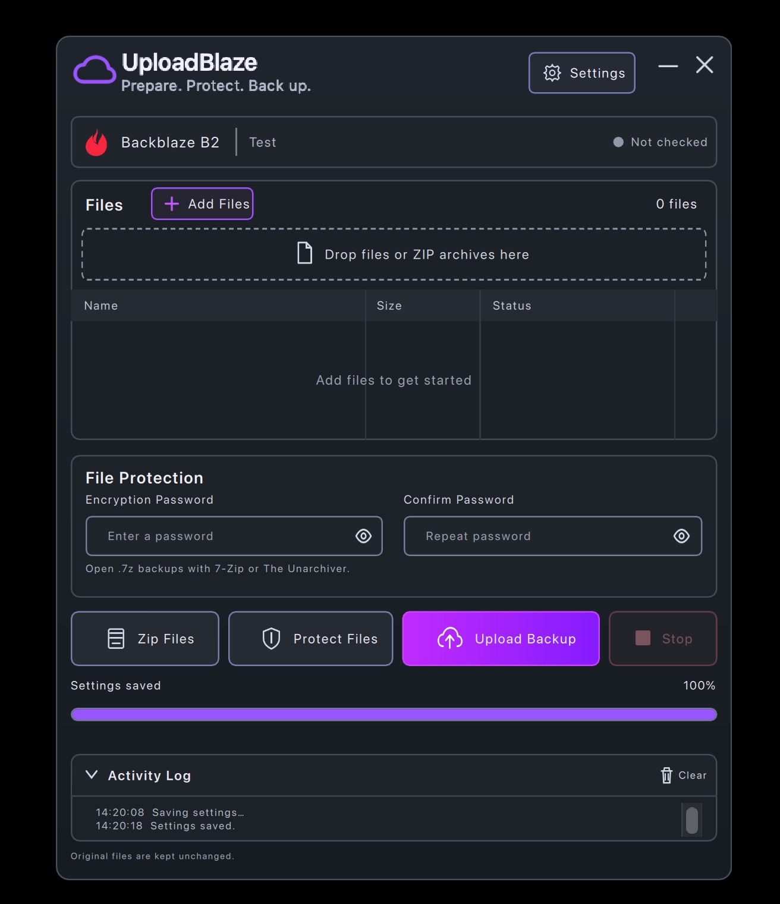

# UploadBlaze



A desktop app for preparing and uploading encrypted backups to a private Backblaze B2 bucket. English interface, separate Settings window, and background workers keep the app responsive during archive and network operations.

## Use

1. Open **Settings**. Enter **Application Key ID** (`keyID`), **Application Key** (`applicationKey`), **Bucket Name**, and an optional **Remote Folder** prefix. Account email and account password are not used.
2. Use a key restricted to your private backup bucket. The app requires `writeFiles`, `listFiles`, `readFiles`, and `listBuckets` to upload and inspect the bucket and uploaded versions. If the key has a filename-prefix restriction, Remote Folder must match it. **Test Connection** checks the settings currently entered; **Save Settings** applies them.
3. **Add Files** or drop regular files into the main window. Folders and symbolic links are rejected. **Zip Files** combines ordinary files into a new ZIP. Existing ZIPs can go directly to protection.
4. Enter and confirm an encryption password (at least 12 characters), then choose **Protect Files**. Each ZIP is wrapped, without recompression, in an AES-256 `.7z` archive with encrypted headers. Verification decrypts the ZIP and checks its members and hash. Imported `.7z` files must use this same single-ZIP, COPY/AES, encrypted-header format; arbitrary 7z archives and old password-protected ZIPs are not supported by this workflow.
5. **Upload Backup** uploads only verified protected archives. It uses private, verified snapshots so changing an original path cannot change the bytes sent. Successful uploads are confirmed against B2 version metadata, size and checksum. **Stop** requests cancellation; an in-flight network request or encryption header operation may take time to return. Wait until the app reports completion or stop before closing.

ZIP and protected 7z archives are saved directly on the operating system's Desktop (`~/Desktop` on macOS). Original files remain unchanged. The list's remove button only removes a queue entry. Keep the encryption password separately: the app does not store it or recover it. To restore a backup, download its `.7z` file, open it with **7-Zip** or **The Unarchiver** and your password, then extract the enclosed ZIP. On the tested macOS 15.3.1 system, Archive Utility 10.15 repeatedly rejected the correct password for encrypted 7z files, including files produced by official 7-Zip. Use **Open With → The Unarchiver** on macOS; this extractor recovered the exact original ZIP in our local test.

**Remember key on this device** uses macOS Keychain, Windows Credential Locker, or a supported Linux Secret Service/KWallet backend. Otherwise the key stays in memory until the app exits. On Linux, secure storage requires a working desktop keyring. The app refuses plaintext keyring fallbacks. Nonsecret settings and retry journals use the system application-data directory. Damaged settings can be replaced by saving a new configuration; the damaged file is preserved as a uniquely named backup.

Retries of the same batch use the same remote job folder and reconcile completed/uncertain results. Remote filenames are opaque indexed hashes; the original ZIP name is inside the encrypted archive. To retry after restarting the app, add the same protected files and verify them with their password. There is no automatic remote deletion or backup schedule. An interrupted multipart upload may leave unfinished server-side parts; manage these through your bucket lifecycle policy or Backblaze console.

Verification temporarily needs local disk space: the size of the decrypted inner ZIP during archive checking, and the combined protected batch size during upload. The decrypted ZIP is held in a private system temporary file removed on success, error or cancellation; this is not a secure-erasure guarantee. Protected upload snapshots are also removed afterwards. Multipart confirmation uses the SDK's part checks and full SHA-1 metadata, not a downloaded remote roundtrip.

Backblaze references: [Application keys](https://www.backblaze.com/docs/en/cloud-storage-application-keys), [key capabilities](https://www.backblaze.com/docs/cloud-storage-application-key-capabilities).

## Source and builds

Python 3.11 and PySide6/Qt Quick. The same Python services and QML forms are used across platforms. Run in a virtual environment:

```sh
python -m venv .venv
# macOS / Linux
source .venv/bin/activate
# Windows PowerShell: .venv\Scripts\Activate.ps1
python -m pip install -r requirements-dev.txt
python app.py
```

The GUI is in `UploadBlazeContent/UploadBlaze.ui.qml` and `SettingsPanel.ui.qml`; window behavior is in `App.qml` and `SettingsWindow.qml`. The project also retains `UploadBlaze.qmlproject` for Qt Design Studio. Python behavior is in `blaze_core/controller.py`, `archives.py`, `cloud.py`, and `settings.py`. The runtime does not use Qt Insight.

```sh
python -m pytest tests -q
python scripts/build.py
```

Build separately on each target OS; PyInstaller does not cross-compile. macOS produces `dist/UploadBlaze.app`; Windows and Linux produce a `dist/UploadBlaze` folder containing the launcher and bundled dependencies. macOS's current local build is Apple Silicon and ad-hoc signed for local testing. Windows/Linux packages and platform credential stores still need native build and acceptance testing. The source is public; the macOS build is not notarized.

## Verification status

Tests cover real archive creation/decryption and corruption detection, cancellation and preservation of originals, settings transactions using a test keyring, B2 upload contracts using offline service doubles and the SDK simulator, and actual QML button events with temporary files. The current macOS validation includes 80 passing automated tests, real B2 upload/download with matching SHA-256, independent extraction, repeat-upload detection, and an interrupted upload successfully retried. See [verification details](docs/verification.md).
